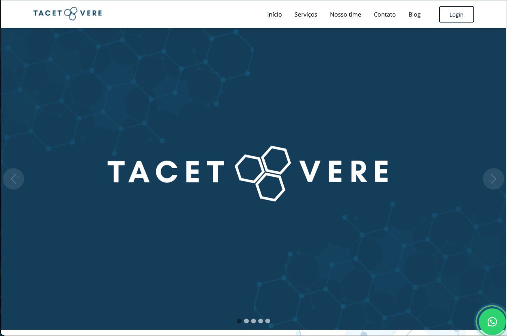

# Tacet Vere

    

## Overview
The main purpose of this project is to create a webpage to a cliente about environmental engineering.

## Libraries 

- Bcrypt => Crypt passwords;
- Dotenv => Hide keys;
- EJS => Render HTML;
- Express => Flexible framework;
- Express-sessions => Create auth sessions;
- MySql2 => Creatin dialect database
- Nodemon => update server automatically
- TinyMCE => Text editor;
- Sequelize => Connect database;
- Slugify => Create string without space;

## You can access the application on the link below

<a src="https://tacetvere.com">Tacet Vere</a>

## Licenses
 

    

    

